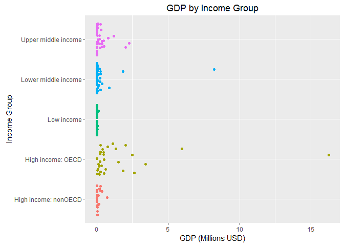
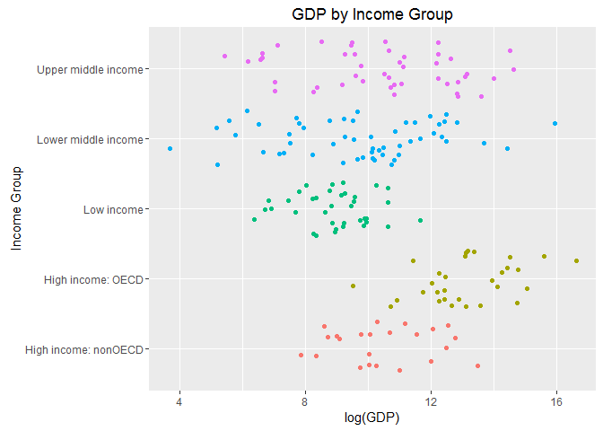
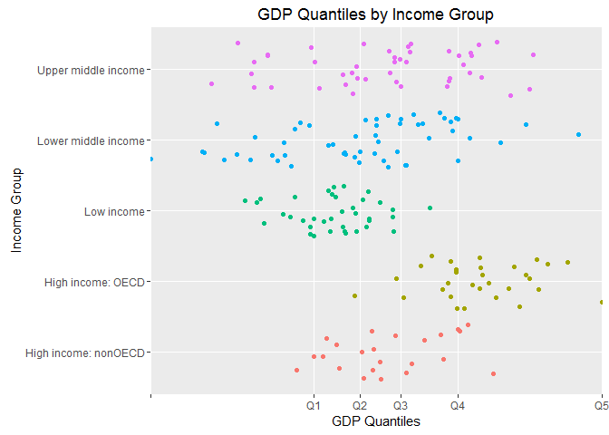

# GDP Case Study
Jose Q  
12 de junio de 2016  


```r
## code from LoadData.R

## Set working directory for this project
setwd("/documents/personal/smu/doing data science/u6/casestudyu6")

## Load downloader library
library(downloader)

## Download files: GDP & EDSTATS
download("https://d396qusza40orc.cloudfront.net/getdata%2Fdata%2FGDP.csv",destfile="GDP.csv")
download("https://d396qusza40orc.cloudfront.net/getdata%2Fdata%2FEDSTATS_Country.csv",destfile="EDSTATS_Country.csv")

## Read files: GDP & EDSTATS
gdp <- read.csv("GDP.csv", stringsAsFactors = FALSE, header = FALSE)
edstats <- read.csv("EDSTATS_Country.csv", stringsAsFactors = FALSE, header = FALSE)
```


```r
## Code from FormatGDP.R

## Asssign initial working vector
gdp1 <- gdp

## Eliminate the first 5 rows and the last 5 rows because their structure don't match with the structure 
gdp2 <- gdp1[6:236,]

## Eliminate columns:3, 6:10 because they are nulls
gdp3 <- gdp2[,c(1,2,4,5)]

## Assign names to columns according to content
names(gdp3) <- c("country_name_3c", "country_ranking", "country_name", "country_gdp")

## Convert ranking and gdp to numeric data
gdp3$country_ranking <- as.integer(gdp3$country_ranking)
gdp3$country_gdp <- as.numeric(gsub(",","",gdp3$country_gdp)) ## eliminate Thousands commas before converting to numeric
```

```
## Warning: NAs introducidos por coerción
```

```r
## Eliminate rows that do not correspond to a country
Missing_values <- is.na(gdp3$country_ranking) ## ranking = NA represent non specific countries
gdp4 <- gdp3[!is.na(gdp3$country_ranking),] ## 190 countries (GDP) tidy dataset
```


```r
## Code from FormatEDSTATS.R

## Asssign initial working vector
edstats1 <- edstats

## Assign names to columns according to content of row 1
names(edstats1) <- gsub(" ", "_", edstats1[1,])

## Eliminate the first row because it corresponds to column names
edstats2 <- edstats1[2:235,] ## 234 countries (EDSTATS) tydy dataset
```


```r
## Code from Merge.R

## Question 1
## Match the data based on the country shortcode. How many of the IDs match? 

## Merge both dataframes joining them by the country shortcode
m1 <- merge(x=gdp4, y=edstats2, by.x = "country_name_3c", by.y = "CountryCode")
dim(m1) ## The number of observations responds to the question of the matching IDs
```

```
## [1] 189  34
```

```r
## Answer 1
## 189 out of 190 GDP records matched (only South Sudan wasn't included in EDSTATS)
```

# Question 1
### Match the data based on the country shortcode. How many of the IDs match? 

# Answer 1
### 189 out of 190 GDP records matched (only South Sudan wasn't included in EDSTATS)


```r
## Question 2
## Sort the data frame in ascending order by GDP rank (so United States is last).
## What is the 13th country in the resulting data frame?

## Sorting dataframe m1 into m2
m2 <- m1[order(-m1$country_ranking),] ## descending order on ranking so USA is last
m2[13,"country_name"] ## name of the 13th country
```

```
## [1] "St. Kitts and Nevis"
```

```r
## Answer 2
## St. Kitts and Nevis (KNA) is in position 13 acccording to an ascending order by GDP (or descending order by Ranking)

## St. Kitts and Nevis has a GDP of 767 USD and is ranked #178
## Grenada (GRD) is in position 12 with the same GDP of 767 USD and is also ranked #178
```

# Question 2
### Sort the data frame in ascending order by GDP rank (so United States is last).
### What is the 13th country in the resulting data frame?

# Answer 2
### St. Kitts and Nevis (KNA) is in position 13 acccording to an ascending order by GDP (or descending order by Ranking)

### St. Kitts and Nevis has a GDP of 767 USD and is ranked #178
### Grenada (GRD) is in position 12 with the same GDP of 767 USD and is also ranked #178


```r
## Question 3
## What are the average GDP rankings for the "High income: OECD" 
## and "High income: nonOECD" groups? 

## Filter High income: OECD countries and get their mean for Ranking
m3 <- m2[m2$Income_Group == "High income: OECD",]
m3_mean <- mean(m3$country_ranking)
m3_mean ## ranking mean for countries whose Income_Group == "High income: OECD"
```

```
## [1] 32.96667
```

```r
## Filter High income: nonOECD countries and get their mean for Ranking
m4 <- m2[m2$Income_Group == "High income: nonOECD",]
m4_mean <- mean(m4$country_ranking)
m4_mean ## ranking mean for countries whose Income_Group == "High income: nonOECD"
```

```
## [1] 91.91304
```

```r
## Answer 3
## The mean ranking for High income: OECD is 32.96 (GDP average for this group is $1,483,917 USD)
## The mean ranking for High income: nonOECD is 91.91 (GDP average for this group is $104,349 USD)
```

# Question 3
### What are the average GDP rankings for the "High income: OECD" 
### and "High income: nonOECD" groups? 

# Answer 3
### The mean ranking for High income: OECD is 32.96 (GDP average for this group is $1,483,917 USD)
### The mean ranking for High income: nonOECD is 91.91 (GDP average for this group is $104,349 USD)


```r
## Code from Plot.R

## Question 4
## Plot the GDP for all of the countries. 
## Use ggplot2 to color your plot by Income Group. 


## Load ggplot2 library
library(ggplot2)

## Plot GDP having: X axis = Income Group, Y axis = GDP (divided by 1M)
## Axes are inverted
## Colored by Income Group
ggplot (m2, 
        aes(x = Income_Group, y = (country_gdp/1000000), color = Income_Group)) +
  geom_jitter() +
  coord_flip() +
  theme(legend.position="none") +
    xlab("Income Group") +
    ylab("GDP (Millions USD)") +
  labs(title="GDP by Income Group") 
```

<!-- -->

```r
## Answer 4
## Plot gdp (in millions USD) for all countries 
## Interpretation: The plot shows how most of the countries' GDP (184 out of 189) are below $2.5M
## and reveals a few emerging countries as opportunity areas for boosting development
```

# Question 4
### Plot the GDP for all of the countries. 
### Use ggplot2 to color your plot by Income Group.

# Answer 4
### Plot gdp (in millions USD) for all countries 
### Interpretation: The plot shows how most of the countries' GDP (184 out of 189) are below $2.5M and reveals a few emerging countries as opportunity areas for boosting development


```r
## Plot GDP having: X axis = Income Group, Y axis = log(GDP)
## Considering log(gdp) for better resolution
## Axes are inverted
## Colored by Income Group
ggplot (m2, 
        aes(x = Income_Group, y = log(country_gdp), color = Income_Group)) +
  geom_jitter() +
  coord_flip() +
  theme(legend.position="none") +
  xlab("Income Group") +
  ylab("log(GDP)") +
  labs(title="GDP by Income Group") 
```

<!-- -->

```r
## Answer 4
## Plot log(gdp) for all countries 
## Interpretation: The plot shows less differences  than the previous one,
## but reveals more clearly the number of countries for each income group
```

### Plot log(gdp) for all countries 
### Interpretation: The plot shows less differences  than the previous one,
### but reveals more clearly the number of countries for each income group


```r
##Code from PlotQuantiles.R

## Question 5
## Cut the GDP ranking into 5 separate quantile groups.
## Make a table versus Income.Group. 
## How many countries are Lower middle income 
## but among the 38 nations with highest GDP?

## Calculate 5 quantiles (20% each) considering country gdp
quantiles <- quantile(m2$country_gdp, probs= seq(0,1,0.2))

## Create a new dataset m3 to add the new variable Income_Level
m3 <- m2

## Clasify each country's Income_Level according to the quantile that corresponds to the country_gdp 
m3[m3$country_gdp >= quantiles[1] & m3$country_gdp <= quantiles[2], "Income_Level"] <- "Q1"
m3[m3$country_gdp > quantiles[2] & m3$country_gdp <= quantiles[3], "Income_Level"] <- "Q2"
m3[m3$country_gdp > quantiles[3] & m3$country_gdp <= quantiles[4], "Income_Level"] <- "Q3"
m3[m3$country_gdp > quantiles[4] & m3$country_gdp <= quantiles[5], "Income_Level"] <- "Q4"
m3[m3$country_gdp > quantiles[5] & m3$country_gdp <= quantiles[6], "Income_Level"] <- "Q5"

## Create table to summarize Income_Group (rows) vs Income_Level (columns)
table(m3$Income_Group, m3$Income_Level) ## The intersection between the 4th row and the 5th column respondes to question 5
```

```
##                       
##                        Q1 Q2 Q3 Q4 Q5
##   High income: nonOECD  2  4  8  5  4
##   High income: OECD     0  1  1 10 18
##   Low income           11 16  9  1  0
##   Lower middle income  16  9 11 13  5
##   Upper middle income   9  8  8  9 11
```

```r
## Answer 5
## There are 5 "Lower middle income" countries 
## within the 38 nations with highest GDP (quantile Q5)
```

# Question 5
### Cut the GDP ranking into 5 separate quantile groups.
### Make a table versus Income.Group. 
### How many countries are Lower middle income but among the 38 nations with highest GDP?

# Answer 5
### There are 5 "Lower middle income" countries within the 38 nations with highest GDP (quantile Q5)


```r
## Plot country gdp by income group
## Considering log(gdp) for better resolution
## Considering 5 quantiles 
ggplot (m2, 
        aes(x = Income_Group, y = log(m2$country_gdp), color = Income_Group)) +
  geom_jitter() +
  coord_flip() +
  ylab("GDP Quantiles") +
  xlab("Income Group") +
  labs(title="GDP Quantiles by Income Group") +
  scale_y_discrete(limits = log(quantiles),
                   labels=c("", "Q1", "Q2", "Q3", "Q4", "Q5")) +
  theme(legend.position="none")
```

<!-- -->

```r
## Plot log(gdp) by country gdp classified according to quantiles
## Interpretation: The plot shows even less differences  than the previous one
## because there is a wide range of GDPs for the 38 nations with highest GDP.
## That's why 5 Lower middle income countries got to be included in this range
```

### Plot log(gdp) by country gdp classified according to quantiles

### Interpretation: The plot shows even less differences  than the previous one because there is a wide range of GDPs for the 38 nations with highest GDP. That's why 5 Lower middle income countries got to be included within this range


# -----------------------------------------------------------------------


# Main findings:

### GDP data reveals extreme differences between contries.

### Data about population is not present to calculate GDP per capita in order to show another perspective.

### Current clasification for Income Group does not neccesarely correspond to the GDP, because there are some contries considered as "Lower middle income" that have bigger GDP that countries considered as "Uppper middle income".

### "High income: nonOECD" countries vary their GDP in several ranges, so some of these countries have smaller GDP than others categorized as "Low Income".


# Conclusions:

### In order to improve the criteria for countries analysis, I propose:
* to separate a variable for OECD Group [Y/N], so each country could be classified as OECD Group in one variable
* Income Group [High, Upper middle, Lower middle, Lower Income] in another variable. So the OECD  variable is independent from the level of income.

### Include population data to facilitate obtaining GDP per capita. 

### Define Income Group category according to GDP per Capita (e.g. High Income = GDP per capita bigger than $30K, Uppper middle = GDP between $20K and $30K, etc).


